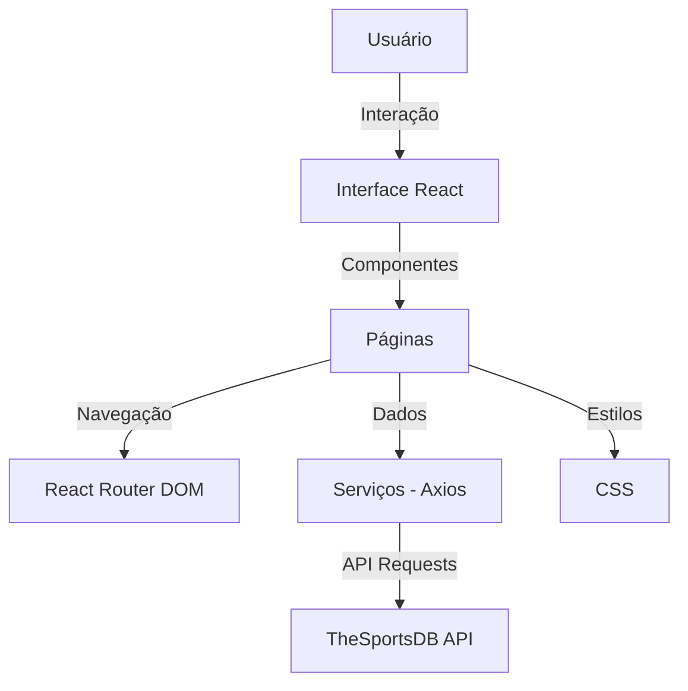

# ⚽ FutVision

🔗 **Acesse o projeto online:**  
👉 https://futvisionweb.vercel.app

📂 **Repositório no GitHub:**  
👉 https://github.com/EduardoColombari/FutVision

---

## 📖 Sobre o Projeto

O **FutVision** é uma aplicação web desenvolvida em **React** que permite visualizar, explorar e comparar informações de futebol em tempo real.

A aplicação consome dados de uma API externa de futebol para fornecer informações detalhadas sobre:

- Ligas  
- Times  
- Jogadores  
- Partidas  

O projeto foi criado com foco em **performance, organização de código e experiência do usuário**, utilizando conceitos modernos de desenvolvimento frontend.

---

## 🚀 Funcionalidades

- 🏆 Listagem de ligas e times  
- 📄 Página de detalhes de jogadores e equipes  
- ⚽ Comparação entre jogadores  
- 📊 Tabelas de classificação  
- 📅 Jogos, resultados e partidas  
- 🔄 Navegação com rotas dinâmicas  
- 📱 Interface responsiva (mobile e desktop)  

---

## 🛠️ Tecnologias Utilizadas

- ⚛️ React  
- ⚡ Vite  
- 🔗 Axios  
- 🧭 React Router DOM  
- 🟨 JavaScript (ES6+)  
- 🎨 CSS  

---

## 🌐 API Utilizada

- ⚽ TheSportsDB API  
  → Utilizada para obter dados de futebol como ligas, times, jogadores e partidas  

---

## 📦 Como Executar o Projeto

### 1. Clone o repositório

```bash
git clone https://github.com/EduardoColombari/FutVision.git
cd FutVision
```

### 2. Instale as dependências

Certifique-se de ter o **Node.js** instalado na sua máquina. Em seguida, execute:

```bash
npm install
```

### 3. Inicie o servidor de desenvolvimento

Para rodar o projeto localmente, utilize o comando:

```bash
npm run dev
```

O projeto estará disponível em: [http://localhost:5173](http://localhost:5173)

### 4. Build para produção

Para gerar uma versão otimizada para produção, execute:

```bash
npm run build
```

Os arquivos otimizados estarão na pasta `dist/`.

### 5. Pré-visualizar o build

Para pré-visualizar o build gerado, utilize:

```bash
npm run preview
```

---

## 🤝 Como Contribuir

1. Faça um fork do projeto.  
2. Crie uma nova branch com a sua feature: `git checkout -b minha-feature`.  
3. Commit suas alterações: `git commit -m 'Adicionando nova feature'`.  
4. Envie para a sua branch: `git push origin minha-feature`.  
5. Abra um Pull Request no repositório original.

---

## 📝 Licença

Este projeto está sob a licença **MIT**. Sinta-se à vontade para utilizá-lo e modificá-lo conforme necessário.

---

## 📷 Capturas de Tela

### Página Principal


### Página de Classificação


### Página de Jogos


### Página de Jogadores


### Página de Comparação de Times


---

## 🏗️ Arquitetura da Aplicação

A arquitetura do **FutVision** segue uma estrutura modular e organizada, utilizando os seguintes conceitos:

- **Páginas (`src/pages`)**: Contém as páginas principais da aplicação, como Home, About, Compare, etc.
- **Componentes (`src/components`)**: Componentes reutilizáveis, como `LeagueCard` e `TeamCard`.
- **Serviços (`src/services`)**: Responsável por chamadas à API externa (ex.: `footballApi.js`).
- **Hooks (`src/hooks`)**: Custom hooks para lógica reutilizável.
- **Estilos (`src/*.css`)**: Arquivos CSS para estilização de componentes e páginas.
- **Assets (`src/assets`)**: Recursos estáticos como imagens e ícones.
- **Utils (`src/utils`)**: Funções utilitárias, como traduções.

### Diagrama da Arquitetura



---

## 🗂️ Boas Práticas de Versionamento

O código-fonte do **FutVision** está versionado no GitHub. Para garantir um bom fluxo de trabalho, siga estas práticas:

- **Commits descritivos**: Use mensagens claras e objetivas, como `git commit -m 'Adiciona funcionalidade de comparação de jogadores'`.
- **Branches organizadas**: Crie branches específicas para cada feature ou correção, como `feature/comparacao-jogadores`.
- **Pull Requests**: Sempre abra um Pull Request para revisão antes de mesclar alterações na branch principal.

---

## 📊 Informações do Projeto

| Faculdade       | Curso                  | Autor              |
|-----------------|------------------------|--------------------|
| Uni-FACEF       | Engenharia de Software | Eduardo Colombari  |